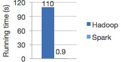

```{r, include=FALSE}
htmltools::tagList(rmarkdown::html_dependency_font_awesome())
# library(knitr)
# opts_chunk$set(
# 	comment = "",
# 	fig.width = 12,
# 	message = FALSE,
# 	warning = FALSE,
# 	tidy.opts = list(
# 		keep.blank.line = TRUE,
# 		width.cutoff = 150
# 		),
# 	options(width = 200),
# 	eval = TRUE
# )
# Sys.setenv(JAVA_HOME='/usr/lib/jvm/java-7-openjdk-amd64')
```

# What is Spark?

## What is Spark?


> **Apache Spark™** is a fast and general engine for large-scale data processing.

<small> Source: [https://spark.apache.org/](https://spark.apache.org/) </small>

# What are the benefits of Spark?

## Speed

Spark runs programs up to 100x faster than Hadoop MapReduce in memory, or 10x faster on disk. 



<small> Source: [https://spark.apache.org/](https://spark.apache.org/) </small>

## Ease of use
Spark has easy-to-use APIs in Java, Scala, Python, R for operating on large datasets. 

## Generality 
Spark comes packaged with higher-level libraries, including support for SQL queries, streaming data, machine learning and graph processing.


<small> Source: [https://databricks.com/spark](https://databricks.com/spark) </small>

# Spark Ecosystem

## Spark SQL + DataFrames

> **Spark SQL** is module for working with structured data.

## Spark SQL + DataFrames

- lets you query structured data inside Spark programs, using either SQL or a familiar DataFrame API
- acts like distributed SQL query engine
- enables unmodified Hadoop Hive queries to run up to 100x faster
- provides industry standard JDBC and ODBC connectivity for business intelligence tools

## Streaming

> **Spark Streaming** makes it easy to build scalable fault-tolerant streaming applications.

## Streaming

- lets you write streaming jobs the same way you write batch jobs.
- is fault-tolerant - recovers lost work out of the box
- intergrates with a wide variety of popular data sources, including HDFS, Flume, Kafka and Twitter

## MLlib (Machine Learning)

> **MLlib** is Apache Spark's scalable machine learning library.

## MLlib (Machine Learning)

- usable in Java, Scala, Python and R
- contains high-quality algorithms that leverage iteration, and can yield better results than the one-pass approximations sometimes used on MapReduce
- runs on existing Hadoop clusters and data

## GraphX (Graph Computation)

> **GraphX** is Apache Spark's API for graphs and graph-parallel computation.

## GraphX (Graph Computation)

- competes on performance with the fastest graph systems while retaining Spark's flexibility, fault tolerance, and ease of use.
- comes with variety of graph algorithms

# Spark in R

## *SparkR* and *sparklyr*

*SparkR* and *sparklyr* are both R interfaces to Spark, which:

- support connecting to local and remote Spark clusters
- provide a *dplyr* compatible back-end
- provide an interface to Spark's built-in machine learning algorithms

<small>Worth reading: [*sparklyr* and *SparkR* - the future?](https://github.com/rstudio/sparklyr/issues/502) </small>

## sparklyr

- connect to Spark from R. The sparklyr package provides a complete *dplyr* backend.
- filter and aggregate Spark datasets then bring them into R for analysis and visualization.
- use Spark’s distributed machine learning library from R.
- create extensions that call the full Spark API and provide interfaces to Spark packages.

## sparklyr


<small> Source: [https://blog.cloudera.com](https://blog.cloudera.com/blog/2016/09/introducing-sparklyr-an-r-interface-for-apache-spark/) </small>

# Let's start coding!